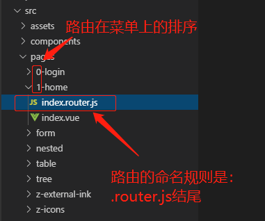
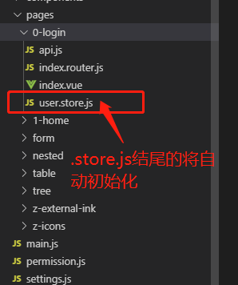
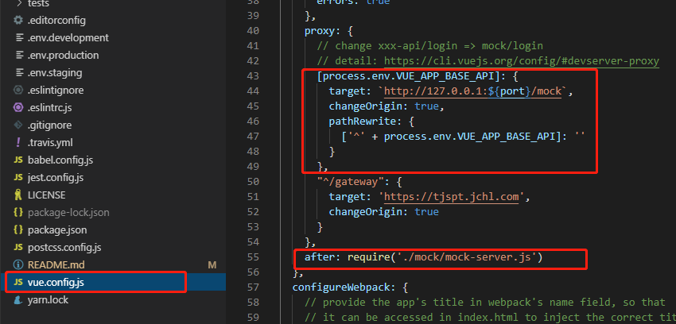
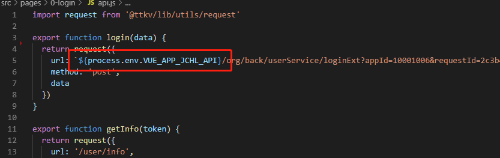
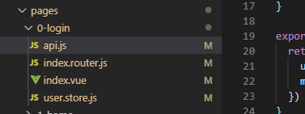

# 基础使用

## 框架简介

` @ttk/vue`是一个后台前端解决方案，它基于 [vue](https://github.com/vuejs/vue) 和 [@ttk/vue-ui](https://github.com/fx-mobile/vue-ui)实现。它使用了最新的前端技术栈，动态路由，权限验证，提炼了典型的业务模型，提供了丰富的功能组件，它可以帮助你快速搭建企业级中后台产品原型。相信不管你的需求是什么，本项目都能帮助到你。

### 框架特点

1. 去中心化，路由和页面store的操作都统一写在在一个文件夹下，代码结构更清晰，一个页面一个文件夹。
2. 支持路由覆盖，业务代码中定义与框架中相同名称的路由名称即可覆盖框架路由。
3. 支持重写框架的view层，无需修改store，复用框架中的store。
4. 封装了部分常用接口，开发者可以直接使用，也可以自己重新写。
5. 保留vue原有特性和数据操作的方法，降低框架学习成本
6. UI在Element-UI V2.12的基础上进行了2次封装，继承Eleemnt-UI所有特性
7. 提供一些常用工具集，如日期格式化，phone校验，asjax封装等。
8. 自带mock和eslint，无需再配置
9. 最低支持IE9

### 集成了哪些开源组件

- 底层：Vue、Vuex、Vue-router、@ttk/vue-ui


- 编译打包工具：vue-cli、babel、webpack、eslint


- 集成工具：cookiejs、axios

### @ttk/vue框架整体组成

- @ttk/vue-ui：基于Element-UI v2.12二次封装的UI框架，继承Element-UI所有功能特点。
- @ttk/vue-app：基于Vue、Vuex、Vue-Router进行封装的应用框架，该框架为业务层提供了项目初始化功能，开发时无需关注项目的初始化、只需按规范给文件命名和放在指定的位置即可。还对常用页面和接口进行了封装，业务层可复用火重写。
- @ttk/vue-template：@ttk/vue项目工程模板，用于创建新项目。


## 如何快速开始

### 安装

```bash
# 克隆项目
git clone https://github.com/fx-mobile/vue-template.git [xxx: 你的项目名称]

# 进入项目目录
cd xxx 

# 安装依赖
npm install

# 建议不要用 cnpm 安装 会有各种诡异的bug 可以通过如下操作解决 npm 下载速度慢的问题
npm install --registry=https://registry.npm.taobao.org

```

> TIP
>
> 强烈建议不要用直接使用 cnpm 安装，会有各种诡异的 bug，可以通过重新指定 registry 来解决 npm 安装速度慢的问题。若还是不行，可使用 [yarn](https://github.com/yarnpkg/yarn) 替代 `npm`。
>
> Windows 用户若安装不成功，很大概率是`node-sass`安装失败，[解决方案](https://github.com/PanJiaChen/vue-element-admin/issues/24)。
>
> 另外因为 `node-sass` 是依赖 `python`环境的，如果你之前没有安装和配置过的话，需要自行查看一下相关安装教程。


### 运行

```bash
# 本地开发 启动项目
npm run dev
```

 启动完成后会自动打开浏览器访问 [http://localhost:9528](http://localhost:9528/)， 你看到下面的页面就代表操作成功了 


## 代码和文件命名规范

### 目录结构规范

 本框架模板已经为你生成了一个完整的项目，在依赖包中已内置了开发时常用接口和页面，下面是整个项目的目录结构。 开发者一般只需要编辑pagas文件夹下的文件即可。

```js
├── build                      # 构建相关
├── mock                       # 项目mock 模拟数据
├── public                     # 静态资源
│   │── favicon.ico            # favicon图标
│   └── index.html             # html模板
├── src                        # 源代码
│   ├── api                    # 所有请求
│   ├── assets                 # 静态资源
│   ├── components             # 全局公用组件
│   ├── router                 # 路由
│   ├── store                  # 全局 store管理
│   ├── pages                  # views 所有页面
│   │   ├── page1              # 页面1
│   │   │   ├── index.vue      # 页面入口
│   │   │   ├── xxx.store.js   # 页面对应store
│   │   │   ├── xxx.router.js  # 页面路由
│   │   ├── page2              # 页面2
│   │   │   ├── index.vue      # 页面入口
│   │   │   ├── xxx.store.js   # 页面对应store
│   │   │   ├── xxx.router.js  # 页面路由
│   ├── main.js                # 入口文件 加载组件 初始化等
│   ├── permission.js          # 权限管理
│   └── styles.scss            # 样式初始化入口
├── tests                      # 测试
├── .env.xxx                   # 环境变量配置
├── .eslintrc.js               # eslint 配置项
├── .babelrc                   # babel-loader 配置
├── .travis.yml                # 自动化CI配置
├── vue.config.js              # vue-cli 配置
├── postcss.config.js          # postcss 配置
└── package.json               # package.json
```


### 命名规范

文件的结构是基本固定不变的，主要是新页面新文件的添加，命名规范也是很重要的一块，文件的命名是中文全拼音，比如（税务人员 -- shuiwurenyuan），一些基本的页面也可以命名为英文名称，请注意这些基本规范

页面文件夹命名规范：统一用小写，保证项目有良好的可移植性，可跨平台。Linux 系统是大小写敏感的，而 Windows 系统和 Mac 系统正好相反，大小写不敏感

- 路由命名规范：路由必须是.router.js结尾，如: login.router.js。框架会根据后缀名自动初始化路由。
- store命名规范：store必须是.store.js结尾，如: user.router.js。
- 页面命名规范：页面入口统一使用index.vue，引入时可以少些文件名
- 类名规范： 必须是大写开头的骆驼拼写发， 如： MockServer
- 变量命名规范： 骆驼拼写法， 如：appName
- css类名规范： 全小写并使用连字符“-”项链， 如：app- container

更多的代码编写规范，我们已经使用ESlint做好配置，开发过程中，ESlint会自动检查。

```
// 强制在单行代码块中使用一致的空格 
// 强制在代码块中使用一致的大括号风格 
// 强制使用骆驼拼写法命名约定 
// 要求构造函数首字母大写 
// 强制在逗号前后使用一致的空格 
// 强制使用一致的逗号风格 
// 强制所有控制语句使用一致的括号风格 
// 是否强制文件末尾至少保留一行空行 
// 要求回调函数中有容错处理 
// 强制使用一致的缩进 
// 强制在 JSX 属性中一致地使用双引号或单引号 
// 强制在对象字面量的属性中键和值之间使用一致的间距 
// 强制在关键字前后使用一致的空格 
// 强制在点号之前和之后一致的换行
// 强制使用全等
// 禁用 debugger 
// 要求调用无参构造函数时有圆括号 
// 禁止使用 Array 构造函数 
// 禁用no-console规则
// 禁止条件表达式中出现模棱两可的赋值操作符 
// 禁止 function 定义中出现重名参数 
// 禁止对象字面量中出现重复的 key 
// 禁止出现重复的 case 标签 
// 禁用 eval() 
// 禁止对 catch 子句的参数重新赋值 
// 禁止不必要的 .bind() 调用 
// 禁止不必要的布尔转换 
// 禁止不必要的括号 
// 禁止对 function 声明重新赋值 
// 禁止在嵌套的块中出现变量声明或 function 声明 
// 禁止在字符串和注释之外不规则的空白 
// 禁止把全局对象作为函数调用 
// 禁用稀疏数组 
// 禁止出现令人困惑的多行表达式 
// 禁止在return、throw、continue 和 break语句之后出现不可达代码 
// 要求使用 isNaN() 检查 NaN
// 强制 typeof 表达式与有效的字符串进行比较 
// 禁用不必要的嵌套块 
// 不允许空格和 tab 混合缩进 
// 禁止使用多个空格
// 禁止使用多行字符串 
// 不允许多个空行 
// 禁止调用 require 时使用 new 操作符 
// 禁止对 String，Number 和 Boolean 使用 new 操作符 
// 禁止对 dirname 和 filename进行字符串连接 
// 禁止使用 var 多次声明同一变量 
// 禁止在 return 语句中使用赋值语句 
// 禁止自我赋值 
// 禁止自身比较 
// 禁用逗号操作符 
// 禁止 function 标识符和括号之间出现空格 
// 禁用行尾空格 
// 禁用未声明的变量，除非它们在 /global / 注释中被提到 
// 禁止将变量初始化为 undefined 
// 禁用一成不变的循环条件 
// 禁止出现未使用过的变量 
// 禁止不必要的 .call() 和 .apply() 
// 禁止属性前有空白 
// 强制函数中的变量要么一起声明要么分开声明 
// 强制操作符使用一致的换行符 
// 强制使用一致的反勾号、双引号或单引号 
// 要求或禁止使用分号而不是 ASI 
// 强制分号之前和之后使用一致的空格 
// 强制在圆括号内使用一致的空格
// 要求操作符周围有空格 
// 强制在一元操作符前后使用一致的空格 
// 强制在注释中 // 或 /* 使用一致的空格
```


## 常用功能

@ttk/vue框架是基于vue + vuex + vue-router进行的封装。主要实现了这三大组件的初始化，让开发在不需要太多的关注框架底层。只需要按vue的规范编写页面即可，达到开箱即用的目的。

在框架的底层，我们已经实现了router和store的自动创建，开发者只需要将router和store按框架的约定命名并放在指定的文件夹下即可，框架层会自动帮你的初始化。

### 创建路由

使用@TTK/vue框架创建路由时，你只需要将路由文件命名为`[XXX].router.js`，然后将它放置在src/pages/xxxx文件夹下即可，框架将会自动扫描带.router.js后缀名的文件，并将它初始化。例如下面



路由index.router.js的配置按vue-router标准配置，例如

```js
import Layout from '@ttkv/packages/layout' // 应用框架中的Layout组件，自带菜单和header
export default {
  path: '/',
  component: Layout,
  redirect: '/home',
  children: [
    {
      path: '/home',
      component: () => import('@/pages/1-home'),
      name: 'Home',
      meta: { title: 'Home', icon: 'fsicon-home' }
    }
  ]
}
```

### 路由组件传参

**使用router-link进行路由导航，传递参数**

```js
// 路由定义
{ 
    path: '/user/:id', 
    component: User
}
```

在页面和组件中可以使用 `this.$route.params.id` 来接受路由参数

```js
export default{
    mounted(){
        this.id = this.$route.params.id
    }
}
```

**带参数的跳转：**使用`$router.push({path：/child/${id}})`可实现带参数的跳转

**通过属性传递参数：**通过路由属性中的name来确定匹配的路由，通过params来传递参数

```js
this.$router.push({
    name:'childView',
    params:{
        id: 123
    }
})

// 种方式子路由配置中必须指定 name属性：
{
    path:'/child',
    name: 'childView',
    component: child
}
```

**通过query来传递参数：**使用path来匹配路由，然后通过query来传递参数，这种情况下 query传递的参数会显示在url后面?id=？

```js
this.$router.push({
    path: '/child',
    query:{
        id: 123
    }
})

// 在页面中接收参数
this.$route.query.id

// 路由配置如下
{
    path: '/child',
    name: 'child'
    component: Child
}

// 地址栏： localhost:8000/#/child?id=123

```


### 创建Vuex store模块
Vuex 是一个专为 Vue.js 应用程序开发的状态管理模式。它采用集中式存储管理应用的所有组件的状态，并以相应的规则保证状态以一种可预测的方式发生变化。在@ttk/vue中，我们已经为你集成里Vuex。如果你以前已经使用过vuex，那你只需要查看本下面内容，了解@ttk/vue框架中store的创建有何约定即可开始编写你的Web应用。如果你你未曾接触过Vuex，请移步动[Vuex官网](https://vuex.vuejs.org/zh/)了解更多后再继续阅读下面内容。
在@ttk/vue框架中，框架会自动扫描src/pages文件夹下所有文件名带有.store.js结尾的文件，并自动初始化。例如下图：



在Vuex中，一个最简单的store对象应该包含 state和mutations， 有了这两个属性后，你可以通过 store.state 来获取状态对象，以及通过 store.commit 方法触发状态变更
```js
// 如果在模块化构建系统中，请确保在开头调用了 Vue.use(Vuex)
const store = new Vuex.Store({
  state: {
    count: 0
  },
  mutations: {
    increment (state) {
      state.count++
    }
  }
})

store.commit('increment') // 使用commit 修改状态
console.log(store.state.count) // -> 1
```
> 注意：Vuex约定所有的数据操作都应该使用commit来提交一个mutation。而非直接改变 `store.state.count`


### 利用路由覆盖，重写框架中的页面

在[@ttk/vue](https://github.com/fx-mobile/vue)框架中我们已经为你内置了一些默认的页面，你可以直接使用它，也可以使用路由覆盖替换默认页面。例如[@ttk/vue-template](https://github.com/fx-mobile/vue-template)中的login页面。

在/pages/login文件夹中定义一个与框架中相同的login路由。并指定到你的页面。如下

```js
// 修改当前path为login可覆盖@ttk/vue框架中的默认路由
export default {
  path: '/login',
  name: 'Login',
  component: () => import('@/pages/login') // 指定你的页面
}
```

在[login.vue](https://github.com/fx-mobile/vue-template/blob/master/src/pages/0-login/)页面中，你可以自由编写你的页面，并可以调用框架中已有得Store模块。例如

```vue
<template>
  <div class="login-container">
    <el-form>
      .....
    </el-form>
  </div>
</template>
<script>
  export default {
  name: "Login",
  methods: {
    handleLogin() {
      this.$refs.loginForm.validate(valid => {
        if (valid) {
          ......
          this.$store
            .dispatch("tax_user/login", this.loginForm) // 直接调用框架中的Store模块
            .then(() => {
              ......
            })
            .catch(() => {
              this.loading = false;
            });
        } else {
          ......
        }
      });
    }
  }
};
</script>

```


### Vuex中两个模块中的action、mutation、state、getters互相调用

在大型应用程序中，状态管理经常变得复杂，因为多个组件之间分散的多个状态以及它们之间的交互。 人们常常忽视Vue实例中的真实来源是原始数据对象–Vue实例只是代理对其的访问。 因此，如果您有一段应该由多个实例共享的状态，则应避免将其复制并通过identity进行共享。 

框架的数据管理使用的是Vuex，在数据操作上没有改变开发者的使用习惯，沿用的Vuex的所有方法。如果你已经使用过vuex，相信你可以快速上手。

**例如** 

**模块**A:

```js
import api from '~api'

const state = {
    vip: {},
}

const actions = {
    async ['get']({commit, state, dispatch}, config = {}) {
        try {
            const { data: { code, data } } = await api.post('vip/getVipBaseInfo', config)
            if (code === 1001) commit('receive', data)
        } catch(error) { console.log(error) }
    }
}

const mutations = {
    ['receive'](state, data) {
        state.vip = data
    }
}

const getters = {
    ['get'](state) {
        return state.vip
    },
}

export default {
    namespaced: true,
    state,
    actions,
    mutations,
    getters
}
```

模块B

```js
import api from '~api'

const state = {
    shop: {},
}

const actions = {
    async ['get']({commit, state, dispatch}, config = {}) {
        try {
            const { data: { code, data } } = await api.post('shop/getShopBaseInfo', config)
            if (code === 1001) commit('receive', data)
        } catch(error) { console.log(error) }
    }
}

const mutations = {
    ['receive'](state, data) {
        state.shop = data
    }
}

const getters = {
    ['get'](state) {
        return state.shop
    },
}

export default {
    namespaced: true,
    state,
    actions,
    mutations,
    getters
}
```

**模块B的actions调用模块A的state**

```js
const actions = {
    async ['shop'](store, config = {}) {
        const { commit, dispatch, state, rootState } = store
        console.log(rootState) // 打印根 state
        console.log(rootState.vip) // 打印其他模块的 state
        try {
            const { data: { code, data } } = await api.post('shop/getShopBaseInfo', config)
            if (code === 1001) commit('receive', data)
        } catch(error) { console.log(error) }
    }
}
```

actions 中的 shop 方法, 有 2 个参数, 第一个是 store, 第二个是 dispatch 调用时传过来的参数，
store 这个对象又包含了 4 个键, 其中 commit 是调用 mutations 用的, dispatch 是调用 actions 用的, state 是当前模块的 state, 而 rootState 是根 state, 既然能拿到根 state, 想取其他模块的 state就简单了。

**模块 B 的 actions 里调用模块 A 的 actions**

```js
const actions = {
    async ['shop'](store, config = {}) {
        const { commit, dispatch, state, rootState } = store
        try {
            const { data: { code, data } } = await api.post('shop/getShopBaseInfo', config, 'get')
            if (code === 1001) commit('receive', data) // 调用当前模块的 mutations
            dispatch('vip/get', {}, {root: true}) // 调用其他模块的 actions
        } catch(error) { console.log(error) }
    }
}
```

上面的代码中dispatch('vip/vip', {}, {root: true})就是在模块 B 调用 模块 A 的 actions, 有 3 个参数, 第一个参数是其他模块的 actions 路径, 第二个是传给 actions 的数据, 如果不需要传数据, 也必须预留, 第三个参数是配置选项, 申明这个 acitons 不是当前模块的

**模块B的actions里调用模块A的mutaions**

```js
const actions = {
    async ['shop'](store, config = {}) {
        const { commit, dispatch, state, rootState } = store
        try {
            const { data: { code, data } } = await api.post('shop/getShopBaseInfo', config)
            if (code === 1001) commit('receive', data) // 调用当前模块的 mutations
            commit('vip/receive', data, {root: true}) // 调用其他模块的 mutations
        } catch(error) { console.log(error) }
    }
}
```

上面的代码中commit('vip/receive', {}, {root: true})就是在模块 B 调用 模块 A 的 mutations, 有 3 个参数, 第一个参数是其他模块的 mutations 路径, 第二个是传给 mutations 的数据, 如果不需要传数据, 也必须预留, 第三个参数是配置选项, 申明这个 mutations 不是当前模块的.

**模块B的actions里调用模块A的getters**

```js
const actions = {
    async ['shop'](store, config = {}) {
        const { commit, dispatch, state, rootState, rootGetters } = store
        console.log(rootGetters['vip/get']) // 打印其他模块的 getters
        try {
            const { data: { code, data } } = await api.post('shop/getShopBaseInfo', config)
            if (code === 1001) commit('receive', data)
        } catch(error) { console.log(error) }
    }
}
```

 我们来看下上面的代码, 相比之前的代码, store 又多了一个键: rootGetters
rootGetters 就是 vuex 中所有的 getters, 你可以用 `rootGetters['xxxxx']` 来取其他模块的getters 

### 内置工具箱列表

为了能给开发者提供一个开箱即用、高效的框架，我们在框架中内置了一下常用的工具。

```js
@ttk/vue
├── uitls
│   ├── index.js
│   ├── auth.js
│   ├── local-storage.js
│   ├── open-window.js
│   ├── validate.js
```

#### index.js工具

```js
/**
 * Parse the time to string
 * @param {(Object|string|number)} time
 * @param {string} cFormat
 * @returns {string}
 */
export function parseTime(time, cFormat)

/**
 * @param {number} time
 * @param {string} option
 * @returns {string}
 */
export function formatTime(time, option)

/**
 * @param {string} url
 * @returns {Object}
 */
export function getQueryObject(url) 

/**
 * @param {string} input value
 * @returns {number} output value
 */
export function byteLength(str)

/**
 * @param {Array} actual
 * @returns {Array}
 */
export function cleanArray(actual)

/**
 * @param {Object} json
 * @returns {Array}
 */
export function param(json)

/**
 * @param {string} url
 * @returns {Object}
 */
export function param2Obj(url)

/**
 * @param {string} val
 * @returns {string}
 */
export function html2Text(val)

/**
 * Merges two objects, giving the last one precedence
 * @param {Object} target
 * @param {(Object|Array)} source
 * @returns {Object}
 */
export function objectMerge(target, source)

/**
 * @param {HTMLElement} element
 * @param {string} className
 */
export function toggleClass(element, className)

/**
 * @param {string} type
 * @returns {Date}
 */
export function getTime(type)

/**
 * @param {Function} func
 * @param {number} wait
 * @param {boolean} immediate
 * @return {*}
 */
export function debounce(func, wait, immediate)

/**
 * This is just a simple version of deep copy
 * Has a lot of edge cases bug
 * If you want to use a perfect deep copy, use lodash's _.cloneDeep
 * @param {Object} source
 * @returns {Object}
 */
export function deepClone(source)

/**
 * @param {Array} arr
 * @returns {Array}
 */
export function uniqueArr(arr)

/**
 * @returns {string}
 */
export function createUniqueString() 

/**
 * Check if an element has a class
 * @param {HTMLElement} elm
 * @param {string} cls
 * @returns {boolean}
 */
export function hasClass(ele, cls)

/**
 * Add class to element
 * @param {HTMLElement} elm
 * @param {string} cls
 */
export function addClass(ele, cls)

/**
 * Remove class from element
 * @param {HTMLElement} elm
 * @param {string} cls
 */
export function removeClass(ele, cls)

```

#### auth.js工具

```js
// 获取tokeng
export function getToken()
// 设置tokeng
export function setToken(token) 
// 删除tokeng
export function removeToken()
```

#### local-storage.js工具

```js
// 添加一个对象
export function setItem(key, data)
// 删除一个对象
export function getItem(key)
```

#### open-window.js

```js
// 打开一个新窗口
export default function openWindow(url, title, w, h) 
```

#### validate.js

```js
/**
 * 使用正则表达判断一个链接 return /^(https?:|mailto:|tel:)/.test(path)
 * @param {string} path
 * @returns {Boolean}
 */
export function isExternal(path) 

/**
 * return /^1[3456789]\d{9}$/.test(phone)
 * @param {string} phone
 * @returns {Boolean}
 */
export function validPhone(phone)

/**
 * @param {string} url
 * @returns {Boolean}
 */
export function validURL(url)

/**
 * @param {string} str
 * @returns {Boolean}
 */
export function validLowerCase(str)

/**
 * @param {string} str
 * @returns {Boolean}
 */
export function validUpperCase(str)

/**
 * @param {string} str
 * @returns {Boolean}
 */
export function validAlphabets(str)

/**
 * @param {string} email
 * @returns {Boolean}
 */
export function validEmail(email)

/**
 * @param {string} str
 * @returns {Boolean}
 */
export function isString(str) 

/**
 * @param {Array} arg
 * @returns {Boolean}
 */
export function isArray(arg)
```


### 内置工具箱的使用

@ttk/vue内置的工具的引用如下。

```js
import {getToken, setToken, removeToken} from '@ttkv/lib/utils/auth'

const token = getToken();
```

> @ttkv是框架的@ttk/vue的别名。已经在vue.config.js中配置好。请勿修改。


## 常用组件 （持续完善中）


## 使用Mock Server

Mock 数据是前端开发过程中必不可少的一环，是分离前后端开发的关键链路。通过预先跟服务器端约定好的接口，模拟请求数据甚至逻辑，能够让前端开发更加独立自主，不会被服务端的开发所阻塞。 

### 移除MockServer

框架内置了mock-server，本地开发时会自动启动。 如果你不想使用`mock-server`的话只要在根目录中的`vue.config.js`中移除`webpack-dev-server`中`proxy`和`after`这个`Middleware`就可以了。 

例如



### 设置代理服务器

开发过程中，我们经常会调用后台不同环境下的接口。这时我们可以通过代理的方式来指定我们接口调用的是哪个域名下的接口。如果后台接口不支持cors模式，代理还能办你解决跨域的问题。

**如下配置将会被代理到指定的域名下**


### 使用环境变量配置配置代理

@ttk/vue框架是基于vue-cli来进行构建的，所有你在在`@TTK/vue`的工程模板中，我们可以找到`.env.development`和`.env.production`、`.env.stagin`文件。你可以根据不同的开发环境设置不同的代理配置。通过配置环境变量，你可以在不同环境中使用不同的代理。

例如配置[.development](https://github.com/fx-mobile/vue-template/blob/master/.env.development)环境变量

```shell
# 自定义环境变量, 变量必须是VUE_APP开头
VUE_APP_JCHL_API = '/gateway'
```

然后在[vue.config.js](https://github.com/fx-mobile/vue-template/blob/master/vue.config.js)的`proxy`中增加一个属性

```js
[process.env.VUE_APP_JCHL_API]: {
    target: 'https://tjspt.jchl.com',
        changeOrigin: true,
        pathRewrite: {
          ['^/' + process.env.VUE_APP_JCHL_API]: ''
        }
      }
}
```

然后在调用接口时使用环境变量



> 如果你想在调用接口时，不同环境代理到不同的后台服务器，你可以使用环境变量轻松实现。


### 新增一个mock接口

 如果你想添加 mock 数据，只要在根本录下找到`mock`文件，添加对应的路由，对其进行拦截和模拟数据即可。 

 比如我现在在[src/api/table]( https://github.com/fx-mobile/vue-template/blob/master/src/api/table.js )中需要添加一个查询某篇文章下面评论数的接口`fetchComments`，首先新建接口： 

> 接口的前缀必须跟你在vue.config.js里设置的代理相同。这里设置的是dev-api

```js
import request from '@ttkv/lib/utils/request'

export function getList(params) {
  return request({
    url: 'dev-api/table/list',
    method: 'get',
    params
  })
}
```

 声明完接口之后，我们需要找到对应的 mock 文件夹[mock/table.js]( https://github.com/fx-mobile/vue-template/blob/master/mock/table.js )，在下面创建一个能拦截路由的 mock 接口 

 请注意，mock 拦截是基于路由来做的，请确 mock 数据一定能匹配你的 api 保路由，支持正则 

```js
import Mock from 'mockjs'

const data = Mock.mock({
  'items|30': [{
    id: '@id',
    title: '@sentence(10, 20)',
    'status|1': ['published', 'draft', 'deleted'],
    author: 'name',
    display_time: '@datetime',
    pageviews: '@integer(300, 5000)'
  }]
})

export default [
  {
    url: '/table/list',
    type: 'get',
    response: config => {
      const items = data.items
      return {
        body: {
          total: items.length,
          items: items
        },
        head: {
          errorCode: '0',
          data: null
        }
      }
    }
  }
]
```


## 和服务端进行交互

### 数据交互流程

在 `@ttk/vue` 中，一个完整的前端 UI 交互到服务端处理流程是这样的：

1. 在页面中利用dispatch调用Store模块中对用的action函数。
2. 在action函数中调用ajax请求函数。
3. ajax请求返回后在actions函数中调用commit函数更新state，
4. 如果页面中已经绑定state，页面将自动更新。

### 数据交互实例

 为了方便管理维护和分工合作，框架规定api放置在对应的页面文件夹中，按页面进行划分。例如login页面。



下面是一个完整的调用实例。详情可查看[login页面](https://github.com/fx-mobile/vue-template/tree/master/src/pages/0-login) 

1. 首先定义开一个调用后的接口

```js
// api.js
import request from '@ttkv/lib/utils/request'

export function login(data) {
  return request({
    url: `${process.env.VUE_APP_JCHL_API}/org/back/userService/loginExt?appId=10001006&requestId=2c3b44751ae520bcfe56a7b782cb548b`,
    method: 'post',
    data
  })
}
```

2. 定义store模块，并在store模块中调用login函数

```js
import { login, logout } from './api'
import { getToken, setToken, removeToken } from '@ttkv/lib/utils/auth'
// import { resetRouter } from '@/router'

const state = {
  token: getToken()
}
const mutations = {
  SET_TOKEN: (state, token) => {
    state.token = token
  }
}
const actions = {
  // user login
  login({ commit }, userInfo) {
    const { loginName, password } = userInfo
    return new Promise((resolve, reject) => {
      // 调用api中的login函数
      login({ loginName: loginName.trim(), password: password }).then(response => {
		...
        // 使用commit更新state。
      })
    })
  }
}
export default {
  namespaced: true,
  state,
  mutations,
  actions
}

```

3. 在页面中调用actions.

```js
// index.vue
methods: {
    handleLogin() {
      this.$refs.loginForm.validate(valid => {
        if (valid) {
          this.loading = true;
          this.$store
            .dispatch("tax_user/login", this.loginForm)
            .then(() => {
              ....
            })
        } else {
          return false;
        }
      });
    }
  }
```

4. 如果页面上需要绑定数据，可参考下面实例。在页面中的computed属性中使用vuex的mapState绑定state。

```js
import { mapState } from "vuex";
computed: {
    ...mapState({
      userName: state => state.tax_user.info.name,

    })
  }
```


## 构建和发布&多环境切换

### 构建

 当项目开发完毕，只需要运行一行命令就可以打包你的应用： 

```bash
# 打包正式环境
npm run build:prod

# 打包预发布环境
npm run build:stage
```

构建打包成功之后，会在根目录生成 `dist` 文件夹，里面就是构建打包好的文件，通常是 `***.js` 、`***.css`、`index.html` 等静态文件。

如果需要自定义构建，比如指定 `dist` 目录等，则需要通过 [config]( https://github.com/fx-mobile/vue-template/blob/master/vue.config.js )的 `outputDir` 进行配置。

### 发布

 对于发布来讲，只需要将最终生成的静态文件，也就是通常情况下 `dist` 文件夹的静态文件发布到你的 cdn 或者静态服务器即可，需要注意的是其中的 `index.html` 通常会是你后台服务的入口页面，在确定了 js 和 css 的静态之后可能需要改变页面的引入路径。 

>  部署时可能会发现资源路径不对 ,只需修改 `vue.config.js` 文件资源路径即可 

```js
publicPath: './' //请根据自己路径来配置更改
```

### 前端路由与服务端的结合

在@ttk/vue中， 前端路由使用的是 `vue-router`，所以你可以选择两种方式：`browserHistory` 和 `hashHistory`。 

 两者的区别简单来说是对路由方式的处理不一样，`hashHistory` 是以 `#` 后面的路径进行处理，通过 [HTML 5 History](https://developer.mozilla.org/en-US/docs/Web/API/History_API) 进行前端路由管理，而 `browserHistory` 则是类似我们通常的页面访问路径，并没有 `#`，但要通过服务端的配置，能够访问指定的 url 都定向到当前页面，从而能够进行前端的路由管理。 

本项目默认使用的是 `hashHistory` ，所以如果你的 url 里有 `#`，想去掉的话，需要切换为 `browserHistory`。 修改 `src/router/index.js` 中的 mode 即可 

```js
export default new Router({
  // mode: 'history', //后端支持可开
})
```

 如果你使用的是静态站点，那么使用 `browserHistory` 可能会无法访问你的应用，因为假设你访问 `http://localhost:9527/dashboard`，那么其实你的静态服务器并没有能够映射的文件，而使用 `hashHistory` 则不会有这个问题，因为它的页面路径是以 `#` 开始的，所有访问都在前端完成，如：`http://localhost:9527/#/dashboard/`。 

 不过如果你有对应的后台服务器，那么我们推荐采用 `browserHistory`，只需要在服务端做一个映射，比如： Nginx

```
location / {
  try_files $uri $uri/ /index.html;
}
```

>  更多配置请查看 [vue-router 文档](https://router.vuejs.org/zh-cn/essentials/history-mode.html) 

### 多环境切换

@ttk/vue框架是基于vue-cli进行编译的。你可以使用下面的命令来切换不同的环境。

开发环境使用

```bash
npm run dev
```

预发布环境使用

```bash
npm run build:stage
```

生成环境使用

```bash
npm run build:prod
```

@ttk/vue框架中，你还可以使用预览模式

```bash
npm run preview
```

> 如果需要在不同环境使用不同代理，请参考`使用环境变量配置配置代理`章节设置不同代理。
